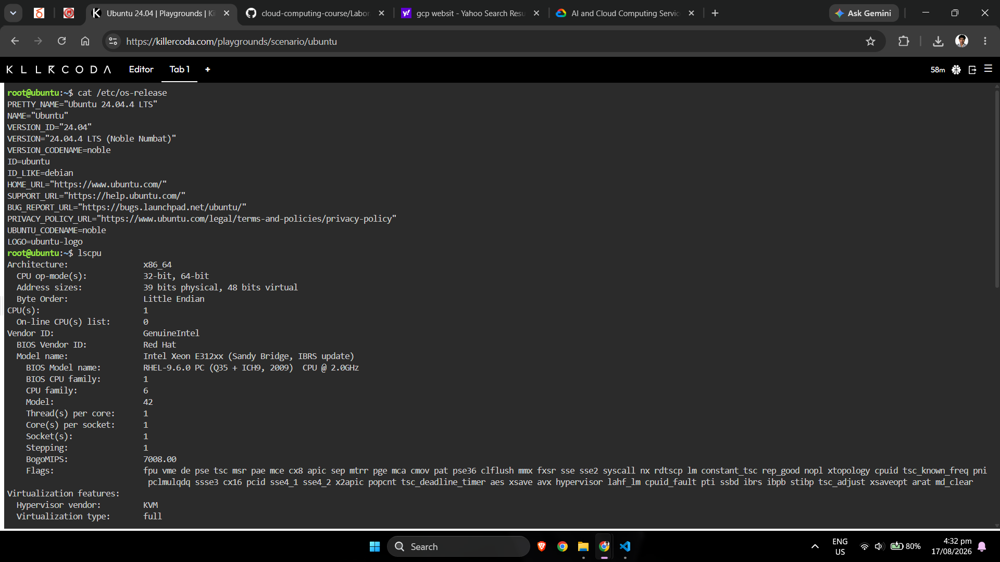
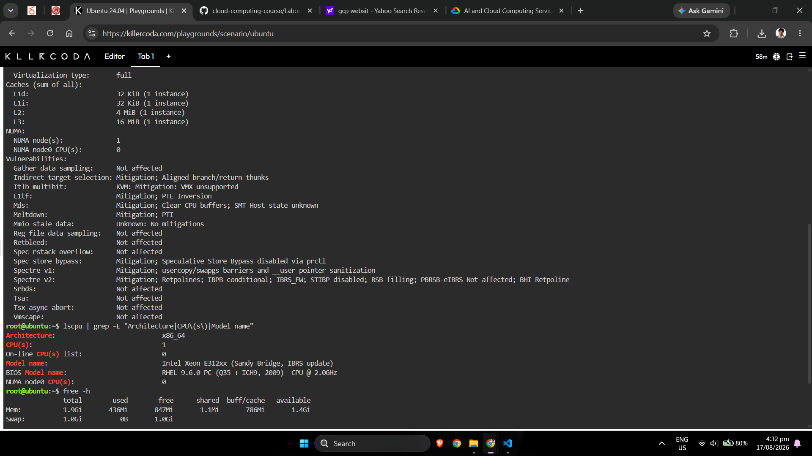
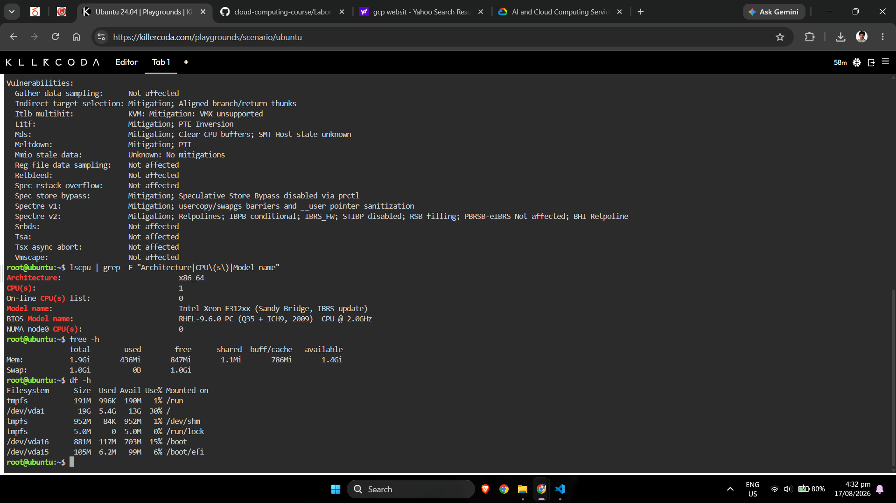

# Checkpoint 7 — Linux Investigation

## Operating System

Command:

```bash
cat /etc/os-release
```

### Result

```text
PRETTY_NAME="Ubuntu 24.04.4 LTS"
NAME="Ubuntu"
VERSION_ID="24.04"
VERSION="24.04.4 LTS (Noble Numbat)"
VERSION_CODENAME=noble
ID=ubuntu
ID_LIKE=debian
```

Based on the command output, the KillerCoda system is running:

**Operating System:** `Ubuntu 24.04.4 LTS`

---

## CPU Information

Command:

```bash
lscpu
```

### Important Results

```text
Architecture: x86_64
CPU(s): 1
Model name: Intel Xeon E312xx (Sandy Bridge, IBRS update)
```

The `lscpu` command displays information about the system's CPU architecture and available processing resources.

---

## Memory Information

Command:

```bash
free -h
```

### Result

```text
               total        used        free      shared  buff/cache   available  
Mem:           1.9Gi       436Mi       847Mi       1.1Mi       786Mi       1.4Gi  
Swap:          1.0Gi          0B       1.0Gi  
```

**Total Memory:** `1.9Gi`

The `free -h` command reports the system's memory usage using human-readable units.

---

## Disk Space

Command:

```bash
df -h
```

### Result

```text
Filesystem      Size  Used Avail Use% Mounted on  
tmpfs           191M  996K  190M   1% /run  
/dev/vda1        19G  5.4G   13G  30% /  
tmpfs           952M   84K  952M   1% /dev/shm  
tmpfs           5.0M     0  5.0M   0% /run/lock  
/dev/vda16      881M  117M  703M  15% /boot  
/dev/vda15      105M  6.2M   99M   6% /boot/efi  
```

The `df -h` command displays the available and used space on mounted filesystems using human-readable units.

---

# KillerCoda Terminal Evidence





---

# Migrating This Linux Server to the Cloud

If this Linux server were migrated to a public cloud environment, all three major cloud providers offer virtual-machine services capable of hosting Linux.

## Amazon Web Services

The server could run on **Amazon EC2 (Elastic Compute Cloud)**.[1]

Amazon EC2 provides virtual machine instances with configurable:

- CPU
- Memory
- Storage
- Networking
- Linux operating systems

A suitable EC2 instance size would be selected according to the Linux server's actual CPU, RAM, disk, and application requirements.

## Microsoft Azure

The Linux server could also run using **Azure Virtual Machines**.[2]

Azure Virtual Machines support Linux and Windows workloads and allow administrators to select virtual machine configurations based on CPU, memory, storage, networking, and workload requirements.

## Google Cloud

On Google Cloud, the server could run using **Compute Engine**.[3]

Compute Engine provides configurable virtual machines capable of running Linux workloads on Google Cloud infrastructure.

---

# Cloud VM Service Mapping

| Cloud Provider | Service That Could Host the Linux Server |
|---|---|
| Amazon Web Services | Amazon EC2 |
| Microsoft Azure | Azure Virtual Machines |
| Google Cloud | Compute Engine |

Therefore, the KillerCoda Linux environment represents the type of server workload that could be migrated to an Infrastructure as a Service virtual machine on AWS, Azure, or Google Cloud. The final VM size should be selected based on the measured CPU, RAM, storage, networking, availability, security, and application requirements.

---

# References

https://aws.amazon.com/ec2/ "Amazon EC2"  
https://learn.microsoft.com/en-us/azure/virtual-machines/overview "Azure Virtual Machines Overview"  
https://cloud.google.com/compute/docs/overview "Google Compute Engine Overview"  
https://killercoda.com/playgrounds/scenario/ubuntu "KillerCoda Ubuntu Playground"  
https://www.freedesktop.org/software/systemd/man/latest/os-release.html "os-release"  
https://man7.org/linux/man-pages/man1/lscpu.1.html "lscpu Manual"  
https://man7.org/linux/man-pages/man1/free.1.html "free Manual"  
https://www.gnu.org/software/coreutils/manual/html_node/df-invocation.html "GNU df Documentation"  