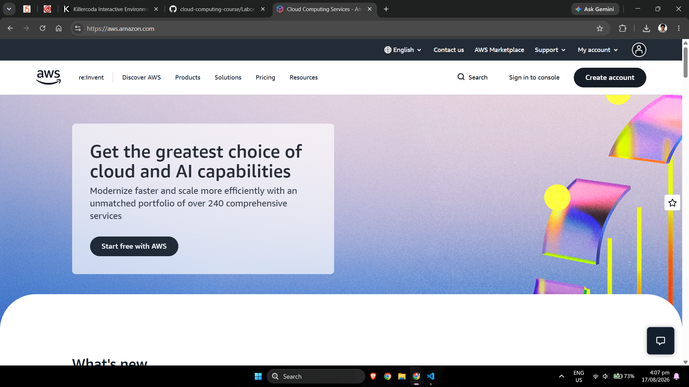

# Amazon Web Services (AWS) Research

## Brief Overview

Amazon Web Services (AWS) is a cloud computing platform provided by Amazon. AWS provides on-demand computing resources and managed services that organizations can use instead of purchasing and maintaining all infrastructure themselves. Its services cover computing, storage, networking, databases, security, analytics, artificial intelligence, application development, and many other areas.[1]

AWS uses a pay-as-you-go cloud model for many of its services, allowing organizations to increase or decrease resources depending on their requirements.

## Global Infrastructure

AWS organizes its global infrastructure primarily into **Regions** and **Availability Zones**.[2]

- **Region** – A separate geographic area where AWS operates cloud infrastructure.
- **Availability Zone (AZ)** – An isolated location within an AWS Region containing one or more data centers.
- **Edge locations** – Locations used by services such as Amazon CloudFront to deliver content closer to users.

Using multiple Availability Zones can improve application availability because workloads can be distributed instead of depending on one physical location.

## Cloud Management Console

AWS resources can be managed using the **AWS Management Console**.[3]

The AWS Management Console is a web-based interface that allows administrators and developers to create, configure, monitor, and manage AWS services. AWS also provides command-line and programmatic management methods such as the AWS CLI, SDKs, APIs, and infrastructure-as-code services.

## Four Core AWS Services

### 1. Amazon EC2

**Amazon Elastic Compute Cloud (EC2)** provides resizable virtual computing resources in AWS.[4]

Organizations can use EC2 instances to run:

- Web servers
- Application servers
- Linux servers
- Windows servers
- Development environments
- Enterprise applications

### 2. Amazon S3

**Amazon Simple Storage Service (Amazon S3)** is an object storage service.[5]

It can be used for:

- Application files
- Documents
- Images and videos
- Backups
- Archives
- Data lakes
- Static website content

### 3. Amazon VPC

**Amazon Virtual Private Cloud (Amazon VPC)** enables customers to create logically isolated virtual networks in AWS.[6]

Administrators can configure:

- IP address ranges
- Subnets
- Route tables
- Internet gateways
- Security controls
- Connections between networks

### 4. AWS Identity and Access Management

**AWS Identity and Access Management (IAM)** is used to control access to AWS resources.[7]

IAM allows administrators to define users, roles, permissions, and policies so that users and applications receive only the access they require.

## Three Advantages of AWS

### 1. Broad Service Portfolio

AWS provides a large collection of cloud services covering infrastructure, databases, analytics, security, artificial intelligence, Internet of Things, containers, serverless computing, and application development.

### 2. Global Infrastructure

AWS Regions and Availability Zones allow organizations to deploy applications in different geographic locations and design systems for high availability.

### 3. Scalability

AWS services can support workloads ranging from small development projects to large enterprise applications. Resources can be increased or reduced according to demand.

## Typical Enterprise Use Cases

Organizations can use AWS for:

- Website and application hosting
- Enterprise application migration
- Backup and disaster recovery
- Data analytics
- Cloud databases
- Artificial intelligence and machine learning
- Containerized applications
- Global content delivery
- Development and testing
- High-performance computing

## AWS Screenshot

## References

https://aws.amazon.com/what-is-aws/ "What is AWS? - Amazon Web Services"  
https://aws.amazon.com/about-aws/global-infrastructure/ "AWS Global Infrastructure"  
https://aws.amazon.com/console/ "AWS Management Console"  
https://aws.amazon.com/ec2/ "Amazon EC2"  
https://aws.amazon.com/s3/ "Amazon S3"  
https://aws.amazon.com/vpc/ "Amazon VPC"  
https://aws.amazon.com/iam/ "AWS Identity and Access Management"