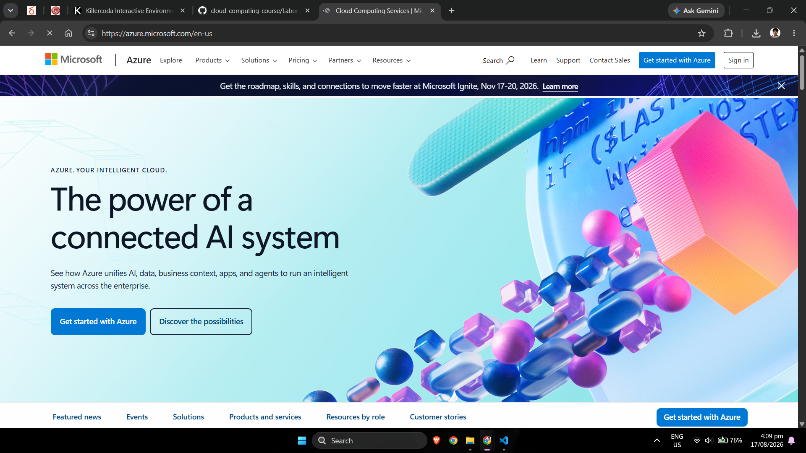

# Microsoft Azure Research

## Brief Overview

Microsoft Azure is Microsoft's cloud computing platform. It provides cloud services for computing, storage, networking, databases, security, analytics, artificial intelligence, application development, and hybrid cloud environments.[1]

Azure is particularly useful for organizations that already use Microsoft technologies because cloud services can be combined with products and technologies such as Windows Server, Microsoft Entra ID, SQL Server, and other Microsoft enterprise solutions.

## Global Infrastructure

Microsoft operates Azure infrastructure in geographic locations around the world.[2]

Azure infrastructure uses concepts such as:

- **Geographies** – Areas containing one or more Azure regions.
- **Regions** – Geographic areas containing Azure infrastructure.
- **Availability Zones** – Physically separated locations within supported Azure regions.

Availability Zones allow organizations to distribute applications and services across separate locations to increase resilience.

## Cloud Management Console

Microsoft Azure provides the **Azure portal**, a web-based console for creating, configuring, monitoring, and managing Azure resources.[3]

Administrators can use it to manage resources including:

- Virtual machines
- Storage accounts
- Networks
- Databases
- Security
- Identity
- Monitoring

Azure can also be managed through Azure CLI, Azure PowerShell, APIs, SDKs, and infrastructure-as-code tools.

## Four Core Azure Services

### 1. Azure Virtual Machines

**Azure Virtual Machines** provide Infrastructure as a Service virtual machines running Windows or Linux.[4]

They can be used for:

- Web servers
- Enterprise applications
- Development servers
- Windows workloads
- Linux workloads
- Application hosting

### 2. Azure Blob Storage

**Azure Blob Storage** is Microsoft's object storage service for large amounts of unstructured data.[5]

Common uses include:

- Images
- Videos
- Documents
- Application data
- Backups
- Archives
- Analytics data

### 3. Azure Virtual Network

**Azure Virtual Network (VNet)** provides private networking for Azure resources.[6]

It enables organizations to configure:

- Address spaces
- Subnets
- Routing
- Network security
- Connections to other networks
- Connections to on-premises environments

### 4. Microsoft Entra ID

**Microsoft Entra ID**, previously known as Azure Active Directory, is Microsoft's cloud-based identity and access management service.[7]

It can provide:

- User authentication
- Application authentication
- Single sign-on
- Identity management
- Access policies
- Security controls

## Three Advantages of Azure

### 1. Strong Microsoft Ecosystem Integration

Azure integrates closely with Microsoft's enterprise technologies and is therefore attractive to organizations already using Microsoft-based infrastructure.

### 2. Hybrid Cloud Capabilities

Azure provides solutions for organizations operating combinations of on-premises infrastructure and cloud infrastructure.

### 3. Enterprise Services

Azure provides enterprise cloud services for computing, databases, identity, analytics, security, artificial intelligence, and application development.

## Typical Enterprise Use Cases

Typical Azure use cases include:

- Migrating Windows Server workloads
- Hybrid cloud deployments
- Enterprise identity management
- Microsoft-based application hosting
- Database modernization
- Backup and disaster recovery
- Web application deployment
- Virtual desktop infrastructure
- Artificial intelligence applications
- Data analytics

## Azure Screenshot

## References

https://azure.microsoft.com/en-us/resources/cloud-computing-dictionary/what-is-azure "What is Microsoft Azure?"  
https://azure.microsoft.com/en-us/explore/global-infrastructure "Azure Global Infrastructure"  
https://azure.microsoft.com/en-us/get-started/azure-portal "Azure Portal"  
https://learn.microsoft.com/en-us/azure/virtual-machines/overview "Azure Virtual Machines Overview"  
https://learn.microsoft.com/en-us/azure/storage/blobs/storage-blobs-overview "Azure Blob Storage Introduction"  
https://learn.microsoft.com/en-us/azure/virtual-network/virtual-networks-overview "Azure Virtual Network Overview"  
https://learn.microsoft.com/en-us/entra/fundamentals/whatis "What is Microsoft Entra ID?"  