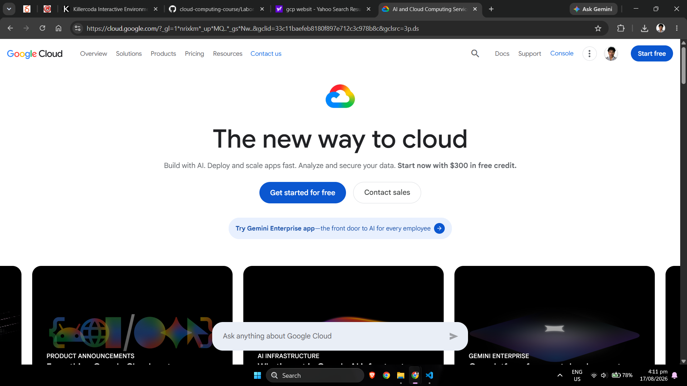

# Google Cloud Platform (GCP) Research

## Brief Overview

Google Cloud provides cloud computing services for infrastructure, storage, networking, databases, data analytics, artificial intelligence, machine learning, containers, and application development.[1]

Google Cloud is particularly well known for technologies associated with data processing, artificial intelligence, machine learning, and Kubernetes-based application deployment.

## Global Infrastructure

Google Cloud organizes infrastructure using **regions** and **zones**.[2]

- **Region** – An independent geographic area containing Google Cloud infrastructure.
- **Zone** – A deployment area located within a region.

Organizations can deploy resources across multiple zones or regions to increase reliability and serve customers closer to their geographic locations.

## Cloud Management Console

Google Cloud provides the **Google Cloud console**, which is a browser-based interface for creating and managing Google Cloud resources.[3]

It can be used to manage:

- Virtual machines
- Storage
- Networks
- Databases
- Kubernetes clusters
- Identity permissions
- Artificial intelligence resources
- Monitoring

Google Cloud also provides the Google Cloud CLI, APIs, SDKs, and infrastructure-as-code options.

## Four Core GCP Services

### 1. Compute Engine

**Google Compute Engine** provides configurable virtual machines running on Google's cloud infrastructure.[4]

It can host:

- Linux servers
- Windows servers
- Web applications
- Development environments
- Business applications
- Compute-intensive workloads

### 2. Cloud Storage

**Google Cloud Storage** provides object storage for data in Google Cloud.[5]

It can store:

- Images
- Videos
- Documents
- Backups
- Application files
- Archives
- Analytics datasets

### 3. Virtual Private Cloud

**Google Cloud Virtual Private Cloud (VPC)** provides networking functionality for cloud resources.[6]

It supports:

- Networks
- Subnets
- Routes
- Firewalls
- Private connectivity
- Hybrid connectivity

### 4. Cloud Identity and Access Management

**Google Cloud Identity and Access Management (IAM)** controls who can perform actions on Google Cloud resources.[7]

IAM permissions are typically assigned using roles, helping organizations manage access to cloud resources.

## Three Advantages of Google Cloud

### 1. Artificial Intelligence and Machine Learning

Google Cloud provides AI and ML services such as Vertex AI for developing, deploying, and managing machine-learning solutions.[8]

### 2. Kubernetes and Container Technologies

Google Kubernetes Engine (GKE) provides a managed environment for deploying and operating Kubernetes applications.[9]

### 3. Data and Analytics Capabilities

Google Cloud provides services for processing, storing, analyzing, and using large datasets, making it suitable for data-intensive workloads.

## Typical Enterprise Use Cases

Google Cloud can be used for:

- Artificial intelligence
- Machine learning
- Data analytics
- Kubernetes applications
- Web application hosting
- Cloud-native development
- High-performance computing
- Storage and backup
- Database hosting
- Global applications

## Google Cloud Screenshot

## References

https://cloud.google.com/docs/overview "Google Cloud Overview"  
https://cloud.google.com/about/locations "Google Cloud Locations"  
https://cloud.google.com/cloud-console "Google Cloud Console"  
https://cloud.google.com/compute/docs/overview "Compute Engine Overview"  
https://cloud.google.com/storage/docs/introduction "Cloud Storage Introduction"  
https://cloud.google.com/vpc/docs/overview "Virtual Private Cloud Overview"  
https://cloud.google.com/iam/docs/overview "Cloud IAM Overview"  
https://cloud.google.com/vertex-ai/docs/start/introduction-unified-platform "Vertex AI"  
https://cloud.google.com/kubernetes-engine/docs/concepts/kubernetes-engine-overview "Google Kubernetes Engine"  